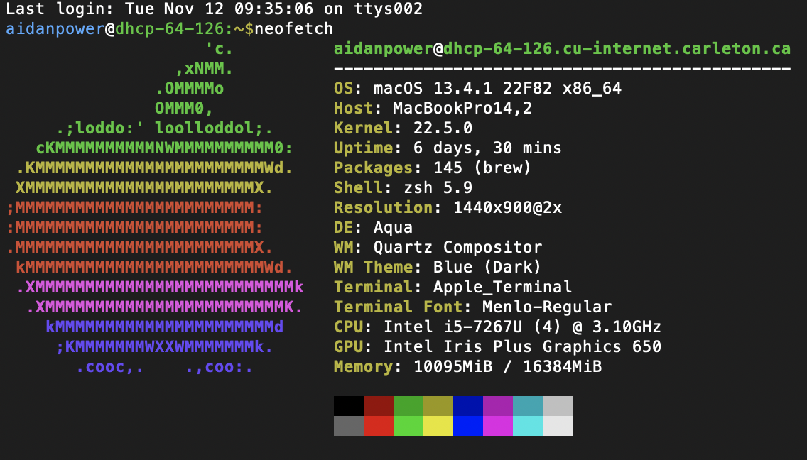

# Coding for the Digital Humanities Fall 2024

[Website link](https://dh-coding-docs.netlify.app/)

## Week 2

**Terminal Beautification**

 
Today I intalled neofetch on my terminal to display the system information. I followed [this tutorial](https://www.howtogeek.com/use-color-with-macs-terminal-to-add-flair-and-function/) which caused a slight issue mimicking linux so it appeared that I was using zshell with bash notation. After removing the code from the source file, the command line now ends in ```~ %``` again.

The problematic code in question:
```
#colorization mimicking linux
PS1="%%n%@%%m:%%~%{$%f%}% "
export CLICOLOR=1
export LSCOLORS=ExFxBxDxCxegedabagacad
```

I also installed [Oh My Zsh](https://ohmyz.sh/#install) which took a moment to get used to but overall I like the display.

**Git Init**

Last week I started to configure git and github, but stopped after getting an SSH key and randomart key. This time 


