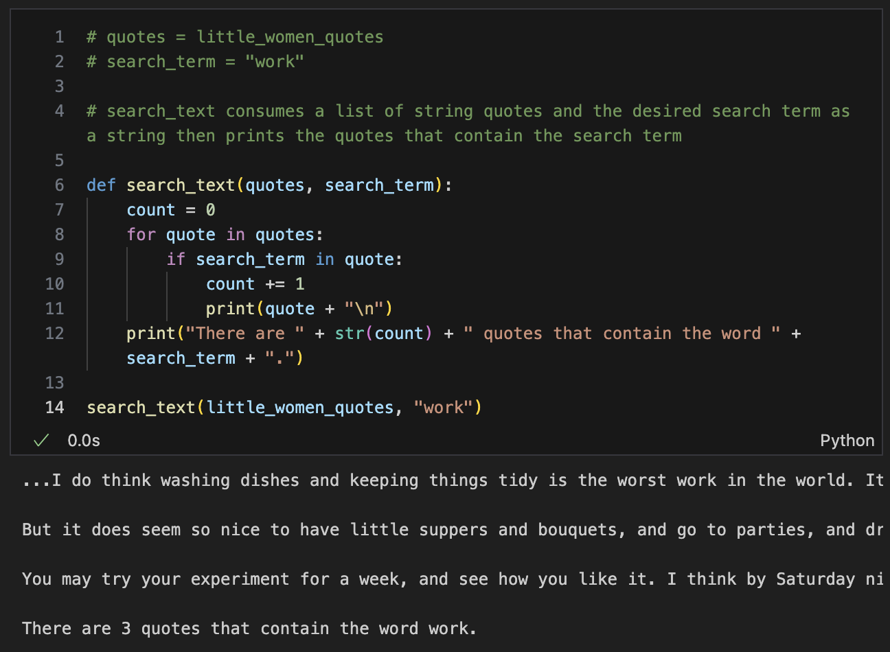
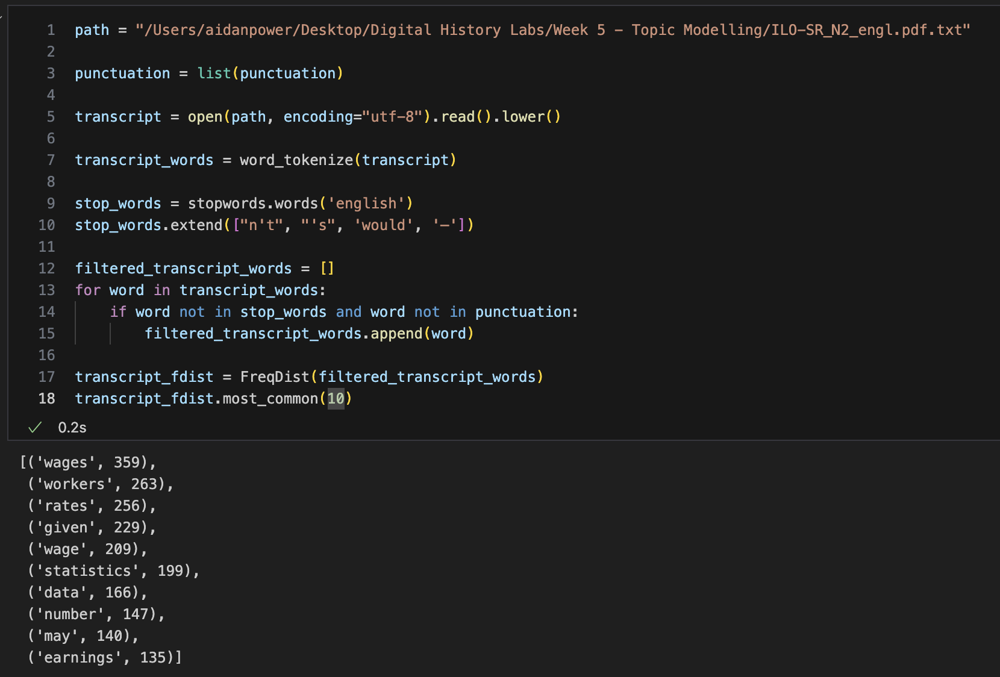
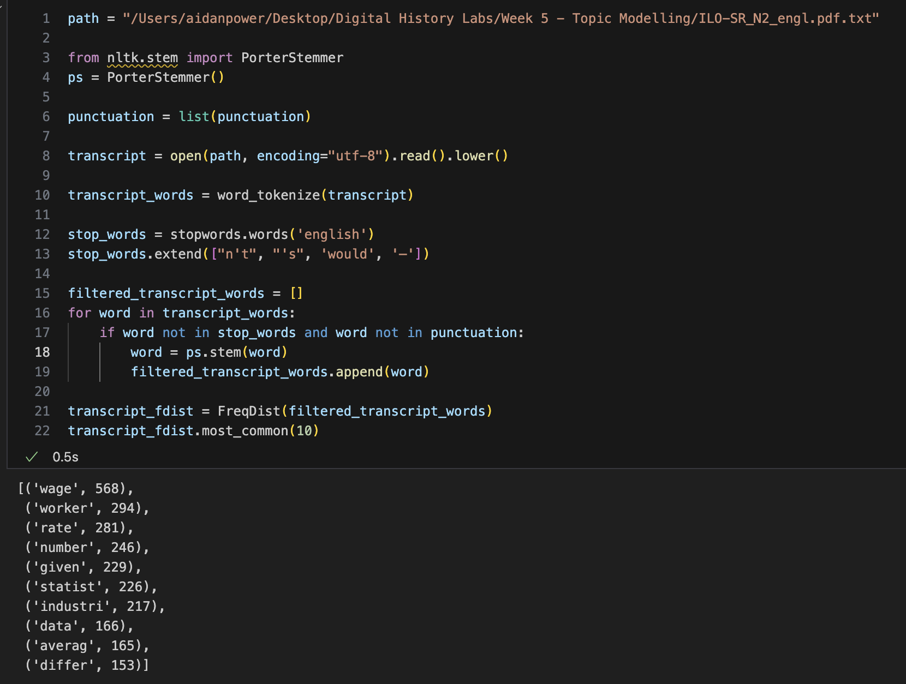
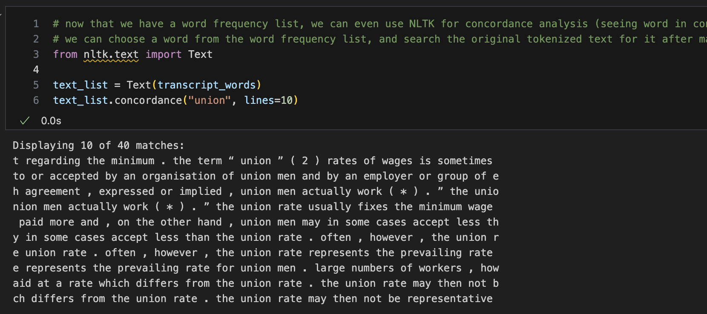
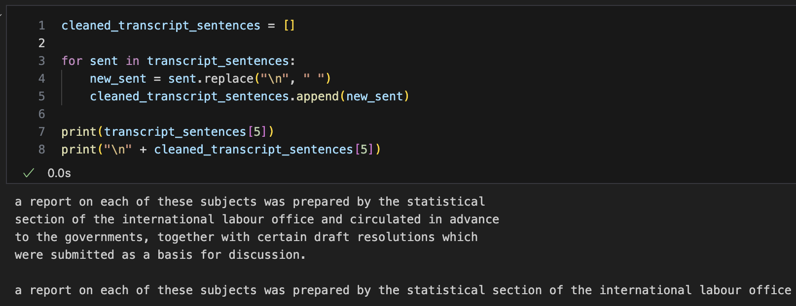

# Coding for the Digital Humanities: Python II

December 3rd, 2024

- [Website link](https://dh-coding-docs.netlify.app/)
- [Home](README.md)

## Functions

Functions can be written to parce text and execute the same block of code over and over again when called. 



I converted the loop example from last week into a function so that the code can search different lists of quotes and various search terms.

## Wrangling Text Data with NLTK

The Natural Language Toolkit tokenizes text by words or sentences and provides a list of common stopwords. 

Double quotations are used when there is an apostrophy in a sentence, because the apostrophy and single quote are the same character.

NLTK allows for:
- **Frequency analysis**: Counting the frequency of tokenized words with stopwords removed.
- **Concordance analysis**: Viewing a desired word in its context, displayed within the tokenized sentences where it appears.

### NLTK activity

For the NLTK activity, I chose a txt file that I extracted from the [ Statistics of Wages and Hours of Labour report](https://webapps.ilo.org/public/libdoc/ilo/ILO-SR/ILO-SR_N2_engl.pdf) from the Interational Labour Office's 1923 International Conference of Labour Statisticians as part of Moritz Mähr's [Programming Historian tutorial](https://programminghistorian.org/en/lessons/working-with-batches-of-pdf-files) about performing OCR and text extracting on PDFs.  

**Frequency analysis** 


**Stemmed frequency analysis**


**Concordance analysis**


**Tokenized sentence cleanup**

I also cleaned up the tokeneized sentences as they were being read with the newline characters included. This is a holdover from being extracted from a pdf, rather than originating from the text file. 

## Pandas

Pandas is a Python library used to view, access and maniupulate dataframes such as CSV or Excel files. 

The tutorial covers:
- How to manipulate data within a column of a dataframe.
- How to change the column headers of a dataframe.
- How to atler the data type of a Pandas Series object to be compatible with other Python funtions. 
- How to filter out NaN values.
- How to search a dataframe using ```.loc``` with a comparison operator. 
- How to save to CSV.