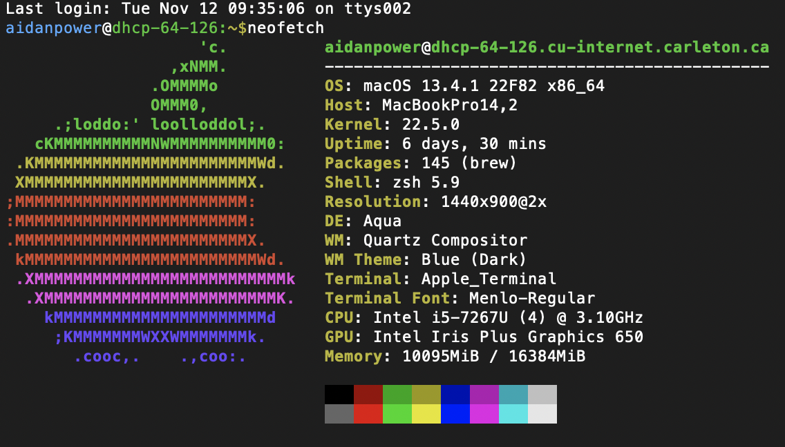

# Coding for the Digital Humanities: Command Line & Git

November 12th, 2024

- [Website link](https://dh-coding-docs.netlify.app/)
- [Home](README.md)


## Terminal Beautification

 
Today I intalled neofetch on my terminal to display the system information. I followed [this tutorial](https://www.howtogeek.com/use-color-with-macs-terminal-to-add-flair-and-function/) which caused a slight issue mimicking linux so it appeared that I was using zshell with bash notation. After removing the code from the source file, the command line now ends in ```~ %``` again. 

I instead installed [Oh My Zsh](https://ohmyz.sh/#install) which took a moment to get used to, but overall I like the display and will play around with the themes to see which one I prefer.

## Git Init

Last week I started to configure git and github, but stopped after getting an SSH key and randomart key through the termminal. This time I got a personal access token through the github website and was able to successfully upload my markdown files and images folder to Github. The problematic code from the colour coding tutorial also caused issues with Github launching my site, so I removed it. 


