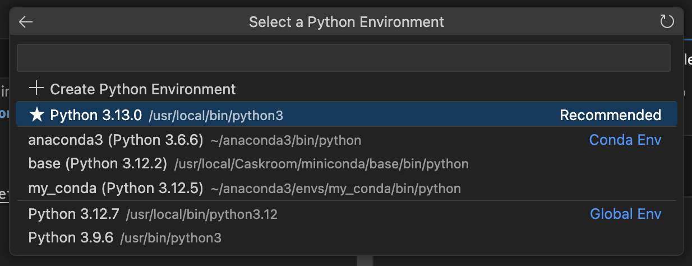

# Coding for the Digital Humanities: Python I

November 19th, 2024

- [Website link](https://dh-coding-docs.netlify.app/)
- [Home](README.md)

## Analog Coding

Identifying keywords, phrases and sentiments in a text is one of the main ways of analyzing text in the humanities. 

This can be done by a computer at a large scale, which allows for easy textual analysis and topic modelling (as long as the text or transcript has been cleaned and preprocessed).

[Nvivo](https://carleton.ca/its/nvivo/) and [Voyant](https://voyant-tools.org/) are examples of tools that help automate this process.

## Python I



When openeing a jupyter notebook in VSCode, select the base model that is installed using miniconda. 

```
git clone https://github.com/ChantalMB/MacOdrum-Coding-for-DH.git
```
Installing the python folder with all of the necessary ipynb, txt, csv and image files.
