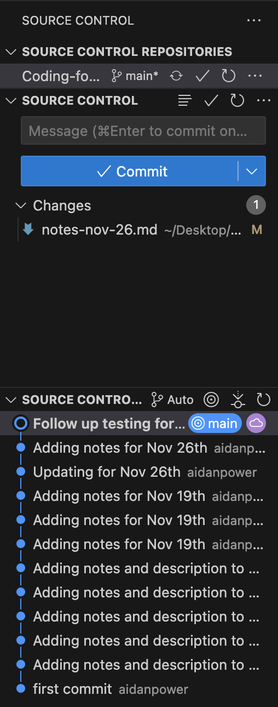
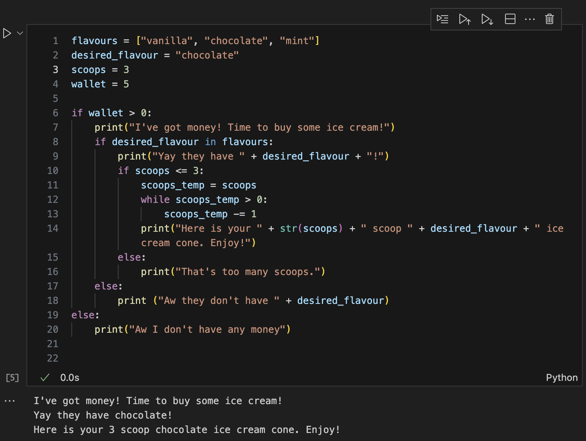
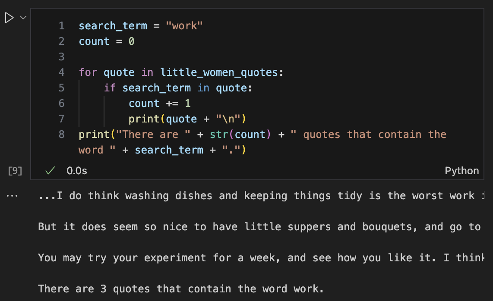

# Coding for the Digital Humanities: Python I + II

November 26th, 2024

- [Website link](https://dh-coding-docs.netlify.app/)
- [Home](README.md)

## Visual Studio Code

 
Alp helped me debug my Visual Studio source control to push directly to github. There was an issue with the main and origin branches not connecting when I tried to push the changes. 

When committing changes from the Visual Studio source control, select the most recent change, sync and then commit.
 

## Python I: If Statements

Variable names should be as descriptive and unique as possible to make the code legible. Python is different from other coding languages as the datatype of the variable does not need to be declared, which makes it easier assign variables, but also easier to write over them with the wrong information.

String comparisons function by converting the strings into unicode and then into binary values that are machine readable.

If else statement example I wrote based on the ice cream flow chart from class:

It's not the most elegant code but it gets the job done. I think the loop could be fixed up a bit so I'm not creating a temporary scoop counting variable.

## Python II: Loops

Loops example I wrote to search the list of little woman quotes for the word "work", print out all of the relevant quotes and print the total number.
